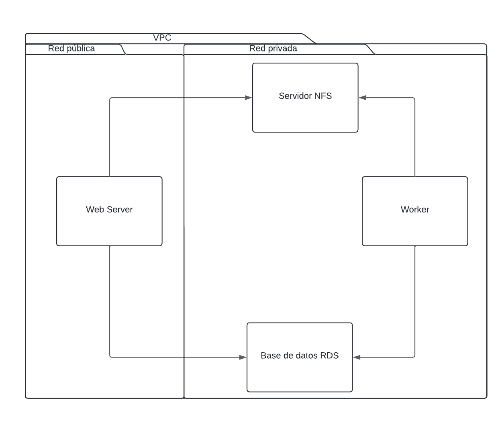
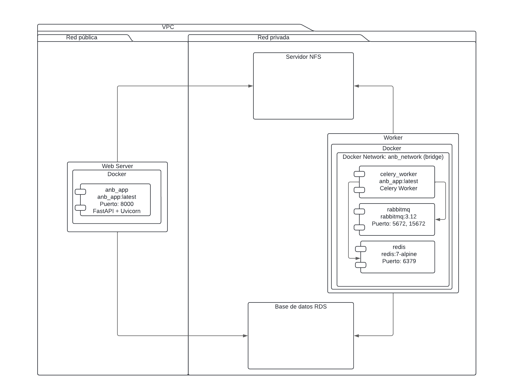
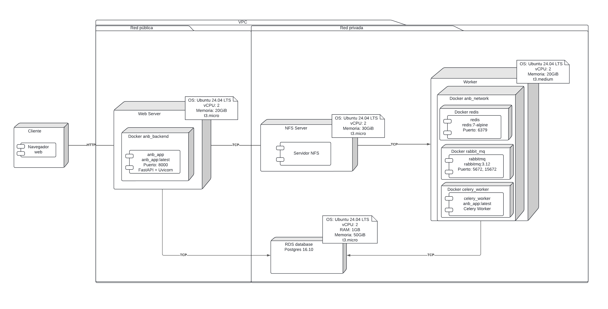
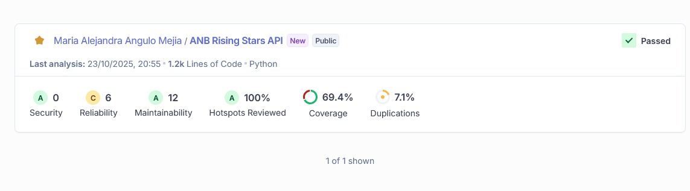

# Despliegue de aplicación en Nube - Documentación

## Arquitectura de la aplicación
Para esta entrega se realizó el despliegue de la aplicación en nube haciendo uso de AWS. La arquitectura de la aplicación, consecuentemente, fue ajustada para cumplir de manera adecuada los requerimientos de infraesructura apropiados requeridos dentro de esta entrega. La arquitectura general que se maneja consiste en el uso de 4 máquinas: una para el servidor Web, una para actuar como un servidor NFS y facilitar la configuración de archivos compartidos, una para el worker de procesamiento de videos y finalmente una para la base de datos que posterioremente fue reemplazada por el servicio de RDS en AWS. Es de resaltar que aspectos generales como el diagrama E/R utilizado previamente y el detalle de los endpoints se mantuvo para esta iteración, razón por la cual se omitirá explicarlos de nuevo y se refiere a la entrega pasada para información adicional de esto. 
A continuación se incluye un pequeño resumen de todas las instancias usadas en cuanto a su tipo y función. 

| **Instancia** | **Tipo** | **Función**                                                                  |
|---------------|----------|------------------------------------------------------------------------------|
| Web Server    | EC2      | Almacena el servidor web en donde corre la aplicación                        |
| Worker        | EC2      | Contiene el worker de celery el cual hace el procesamiento de videos         |
| NFS server    | EC2      | Servidor para que los archivos se compartan de forma correcta entre máquinas |
| Database      | RDS      | Es la instancia de base de datos que funciona como un RDS de AWS            |

## Diagrama de componentes
A continuación se presenta el diagrama de componentes actualizado. 

Como se puede ver dentro del diagrama, se tiene la configuración de una VPC en donde se alojan las máquinas previamente descritas. Es de resaltar que por motivos de seguridad, la única maquina expuesta dentro de una red pública corresponde al Web Server. Las demás instancias se encuentran conectadas dentro de una subred privada de forma que no se puede acceder a ellas directamente, para poder conectarse a ellas se utilizó un rol IAM. 

Previamente se había generado un contenedor de Docker que tenía todos los servicios incluídos dentro de él. Como se modificó la estructura al alojar los diferentes servicios en máquinas separadas, se realizaron modificaciones tal que se permite la separación de servicios en contenedores más pequeños como se puede observar dentro del siguiente diagrama. 

### Diagrama de despliegue
Con lo anterior, se puede introducir adecuadamente el diagrama de despliegue realizado para cumplir con los requerimientos necesarios. 

En este se puede ver la conexión entre todas las máquinas de la red, su protocolo y las capacidades y especificaciones de cada una. Este diagrama detalla como funciona la aplicación la cual es accesible a partir del web server. De igual forma, a continuación se presenta una tabla de resumen en donde se detallan las características de cada máquina utilizada.

| **Instancia** | **Tipo**    | **RAM** | **Memoria** | **vCPU** | **Sistema Operativo/Engine** |
|---------------|-------------|---------|-------------|----------|------------------------------|
| Web Server    | t3.micro    | 1GiB    | 20GiB       | 2        | Ubuntu 24.04                 |
| Worker        | t3.medium   | 2GiB    | 20GiB       | 2        | Ubuntu 24.04                 |
| NFS server    | t3.micro    | 1GiB    | 30GiB       | 2        | Ubuntu 24.04                 |
| Database      | db.t3.micro | 1GiB    | 50GiB       | 2        | PostgresSQL                  |

### Reglas de seguridad
Finalmente, se detallarán las reglas de seguridad configuradas dentro de esta entrega para permitir un tráfico adecuado y controlado de peticiones entre las máquinas aprovisionadas. 

| **Grupo de Seguridad** | **Tipo** | **Protocolo**                  | **Puertos**        | **Instancias** |
|------------------------|----------|--------------------------------|--------------------|----------------|
| bd_firewall            | Inbound  | TCP (PostgreSQL) TCP (SSH) | 5432 22    | Base de datos  |
| Worker                 | Inbound  | TCP (SSH) TCP TCP TCP          | 22 15672 6379 5672 | Worker server  |
| anb_nfs                | Inbound  | TCP                            | 2049               | Servidor NFS   |
| Web Security Group     | Inbound  | TCP SSH HTTP                   | 8000 22 80         | Servidor web   |

Como se puede ver, se tienen diferentes reglas que regulan el flujo de información entre las máquinas. Es de resaltar que la mayoría permite la conexión SSH con el fin de poder editarlas y conectarse a ellas. Así mismo se resalta como la base de datos permite el tráfico relacionado al puerto en el que se ejecuta PostgreSQL pero limita la entrada de otra información. Por el lado del worker ese permite el tráfico en los puertos relacionados con Celery, RabbitMQ y Redis lo que es necesario para su funcionamiento óptimo, el NFS permite tráfico sobre el puerto 2049 con el cuál trabaja, y, finalmente el servidor web hace uso del puerto 8000 para FastAPI y los otros 2 para permitir conexiones remotas al servidor. 

## SonarQube
A continuación se presentan las métricas actuales obtenidas dentro de SonarQube. Como se puede ver, se alcanza un nivel A en cuanto a seguridad, mantenibilidad, y hotspots. Como futuros aspectos a seguir mejorando se encuentra la reducción de duplicación de código la cual alcanza un 7.1%, la cobertura que se encuentra en 69.4% y el nivel de confiabilidad el cual es C en este momento. 
Pese a este, se reporta una mejora frente la iteración pasada en donde no se reportaba la cobertura apropiadamente, se tenía un nivel E de seguridad con 2 issues abiertos y se contaba con un número mayor de issues de mantenibilidad.

Para futuras entregas se propone seguir trabajando en reducir los issues existentes dandole atención principalmente a la comfiabilidad. Sin embargo, se muestra la gráfica a continuación, para mostrar el avance del código en cuanto a su desarrollo apropiado y seguro en donde solo 1 archivo presenta problemas por resolver. Esto deja ver como los cambios y mejoras introducidos ayudan a que se tenga un nivel aceptable y permiten que lo que siga sean mejoras de pcoo consumo de tiempo. 
