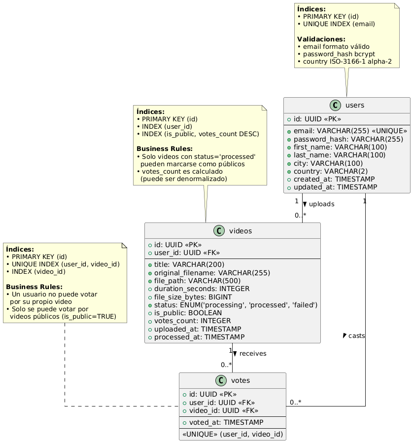
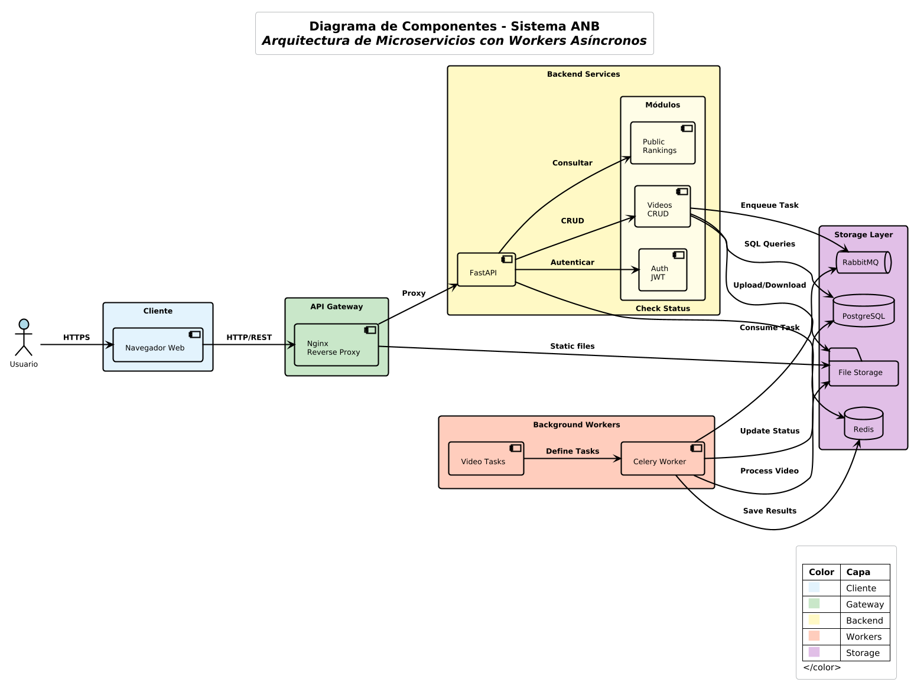
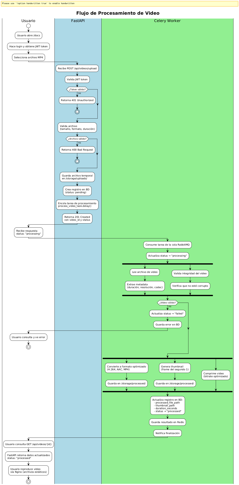
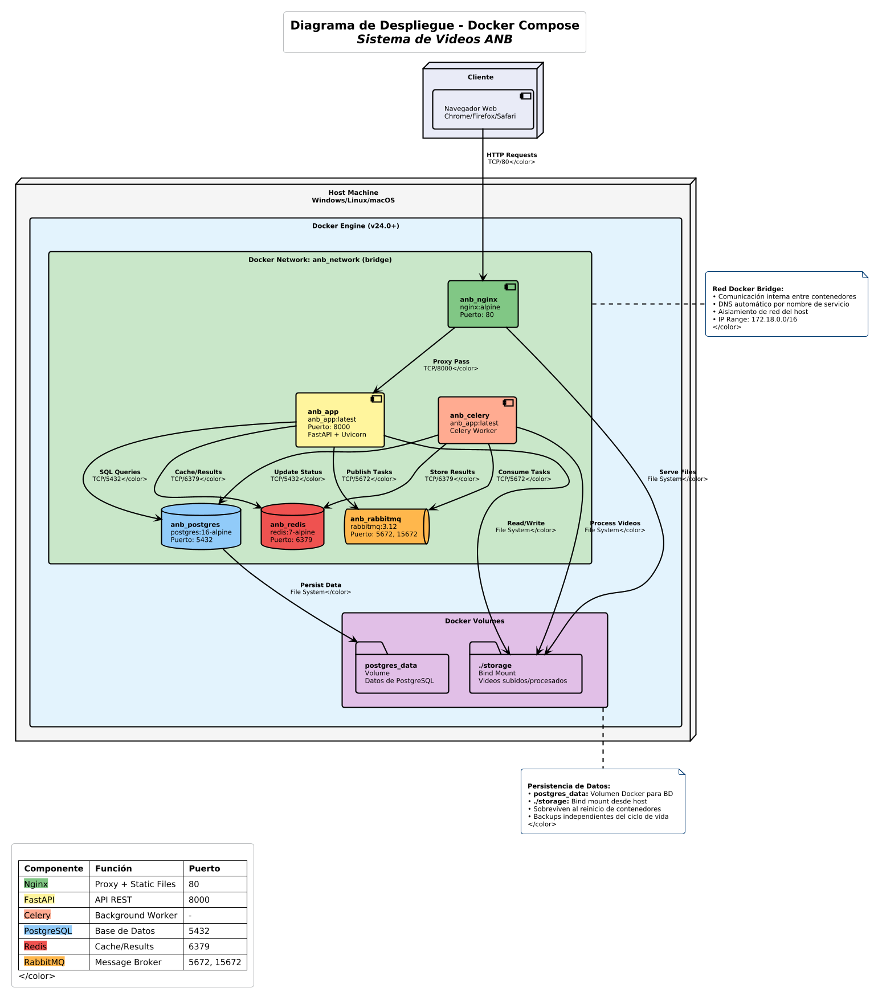

# Sistema de Videos ANB - Documentación

## Modelo de Datos

### Diagrama Entidad-Relación (ERD)



### Descripción del Modelo

El sistema utiliza un modelo relacional con **3 entidades principales** que gestionan usuarios, videos y votaciones.

---

### Entidades y Atributos

#### **1. Users (Usuarios)**

Almacena la información de los usuarios registrados en la plataforma.

| Campo | Tipo | Restricciones | Descripción |
|-------|------|---------------|-------------|
| `id` | UUID | PRIMARY KEY | Identificador único del usuario |
| `email` | VARCHAR(255) | UNIQUE, NOT NULL | Correo electrónico (usado para login) |
| `password_hash` | VARCHAR(255) | NOT NULL | Contraseña hasheada con bcrypt |
| `first_name` | VARCHAR(100) | NOT NULL | Nombre del usuario |
| `last_name` | VARCHAR(100) | NOT NULL | Apellido del usuario |
| `city` | VARCHAR(100) | NOT NULL | Ciudad de residencia |
| `country` | VARCHAR(100) | NOT NULL | País de residencia |
| `created_at` | TIMESTAMP | DEFAULT NOW() | Fecha y hora de registro |
| `updated_at` | TIMESTAMP | DEFAULT NOW() | Última actualización del perfil |

**Índices:**
- `idx_users_email` en columna `email` (búsqueda rápida en login)

**Validaciones:**
- Email formato válido
- Password mínimo 8 caracteres (incluye mayúsculas, minúsculas y números)

---

#### **2. Videos**

Almacena los metadatos y referencias a los archivos de video subidos por usuarios.

| Campo | Tipo | Restricciones | Descripción |
|-------|------|---------------|-------------|
| `id` | UUID | PRIMARY KEY | Identificador único del video |
| `user_id` | UUID | FOREIGN KEY → users(id), NOT NULL | Propietario del video |
| `title` | VARCHAR(255) | NOT NULL | Título del video |
| `description` | TEXT | NULLABLE | Descripción opcional del video |
| `original_filename` | VARCHAR(255) | NOT NULL | Nombre original del archivo subido |
| `file_path` | VARCHAR(500) | NOT NULL | Ruta del archivo original en storage |
| `processed_file_path` | VARCHAR(500) | NULLABLE | Ruta del video procesado |
| `thumbnail_path` | VARCHAR(500) | NULLABLE | Ruta de la imagen miniatura |
| `duration_seconds` | INTEGER | DEFAULT 0 | Duración del video en segundos |
| `file_size_bytes` | BIGINT | NOT NULL | Tamaño del archivo en bytes |
| `status` | ENUM | NOT NULL | Estado del procesamiento |
| `task_id` | VARCHAR(255) | NULLABLE | ID de tarea de Celery |
| `is_public` | BOOLEAN | DEFAULT FALSE | Visibilidad pública |
| `created_at` | TIMESTAMP | DEFAULT NOW() | Fecha de carga |
| `updated_at` | TIMESTAMP | DEFAULT NOW() | Última actualización |
| `processed_at` | TIMESTAMP | NULLABLE | Fecha de procesamiento completado |

**Estados posibles (ENUM `status`):**
- `pending`: Video subido, esperando procesamiento
- `processing`: En proceso de conversión/compresión
- `processed`: Listo para visualización
- `failed`: Error durante el procesamiento

**Índices:**
- `idx_videos_user_id` en `user_id` (listar videos por usuario)
- `idx_videos_status` en `status` (filtrar por estado)
- `idx_videos_is_public` en `is_public` (rankings públicos)

**Validaciones:**
- Formatos permitidos: MP4, AVI, MOV
- Tamaño máximo: 100 MB
- Duración máxima: 10 minutos

---

#### **3. Votes (Votos)**

Almacena los votos (positivos o negativos) que usuarios emiten sobre videos.

| Campo | Tipo | Restricciones | Descripción |
|-------|------|---------------|-------------|
| `id` | UUID | PRIMARY KEY | Identificador único del voto |
| `user_id` | UUID | FOREIGN KEY → users(id), NOT NULL | Usuario que vota |
| `video_id` | UUID | FOREIGN KEY → videos(id), NOT NULL | Video votado |
| `vote_type` | ENUM | NOT NULL | Tipo de voto |
| `created_at` | TIMESTAMP | DEFAULT NOW() | Fecha del voto inicial |
| `updated_at` | TIMESTAMP | DEFAULT NOW() | Última actualización (cambio de voto) |


**Restricciones:**
- `UNIQUE(user_id, video_id)`: Un usuario solo puede votar **una vez** por video
- Al cambiar el voto, se actualiza el registro existente (no se crea uno nuevo)

**Índices:**
- `idx_votes_user_video` en `(user_id, video_id)` (constraint único)
- `idx_votes_video_id` en `video_id` (cálculo de contadores)

---

### Relaciones entre Entidades

#### **Descripción de Relaciones:**

1. **Users ─ Videos (1:N)**
   - Un usuario puede subir múltiples videos
   - Un video pertenece a un único usuario (propietario)
   - Cascade: `ON DELETE CASCADE` (si se elimina el usuario, se eliminan sus videos)

2. **Users ─ Votes (1:N)**
   - Un usuario puede emitir múltiples votos (en diferentes videos)
   - Un voto pertenece a un único usuario
   - Cascade: `ON DELETE CASCADE` (si se elimina el usuario, se eliminan sus votos)

3. **Videos ─ Votes (1:N)**
   - Un video puede recibir múltiples votos (de diferentes usuarios)
   - Un voto está asociado a un único video
   - Cascade: `ON DELETE CASCADE` (si se elimina el video, se eliminan sus votos)

**Regla de negocio clave:**
- Un usuario **NO puede** votar dos veces el mismo video
- Si intenta votar nuevamente, se actualiza el voto existente

---

# Arquitectura de Componentes



## Descripción General

Sistema de microservicios con procesamiento asíncrono organizado en **5 capas**:

### Capas Principales

| Capa | Componente | Puerto | Función |
|------|------------|--------|---------|
| **Presentación** | Navegador Web | - | Interfaz cliente HTTP |
| **Gateway** | Nginx | 80 | Proxy inverso + archivos estáticos |
| **Aplicación** | FastAPI | 8000 | API REST asíncrona |
| **Procesamiento** | Celery Worker | - | Procesamiento de videos |
| **Datos** | PostgreSQL, Redis, RabbitMQ | 5432, 6379, 5672 | Almacenamiento y mensajería |

### Componentes Detallados

#### 1. Nginx (Gateway)
- Proxy inverso hacia FastAPI
- Servidor de archivos estáticos (`/storage`)
- Soporte para Range requests (streaming)

#### 2. FastAPI (Backend)
- API REST con autenticación JWT
- Validación con Pydantic
- Acceso asíncrono a PostgreSQL (asyncpg)
- Encolado de tareas en RabbitMQ

**Endpoints principales:**
- `POST /api/auth/signup` - Registro
- `POST /api/auth/login` - Login
- `POST /api/videos/upload` - Subir video
- `GET /api/videos/` - Listar videos
- `POST /api/videos/{id}/vote` - Votar
- `GET /api/public/rankings/top` - Rankings

#### 3. Celery Worker
- Procesamiento asíncrono de videos
- Conversión con FFmpeg (H.264 + AAC)
- Generación de thumbnails
- Actualización de estado en BD

#### 4. PostgreSQL
- Base de datos principal (Users, Videos, Votes)
- Driver: asyncpg
- Volumen: `postgres_data`

#### 5. Redis
- Backend de resultados de Celery
- Caché de consultas

#### 6. RabbitMQ
- Message broker AMQP
- Cola de tareas de procesamiento
- Management UI: http://localhost:15672

#### 7. File Storage
- Ruta: `./storage` (bind mount)
- Estructura:
  
storage/

├── uploads/ # Temporales

└── processed/ # Videos finales

---

# Flujo de Procesamiento de Videos




## Fases del Procesamiento

### Fase 1: Upload (5-30 seg)

1. **Autenticación**: Validar JWT token
2. **Validación**:
   - Formato: MP4, AVI, MOV
   - Tamaño: máx. 100 MB
   - Duración: máx. 10 minutos
3. **Almacenamiento temporal**: `storage/uploads/temp_*.mp4`
4. **Registro en BD**: `status='pending'`
5. **Encolado**: Publicar tarea en RabbitMQ (`status='processing'`)

**Respuesta:**
```json
{
  "id": "123e4567-...",
  "status": "processing",
  "task_id": "a1b2c3d4-..."
}
```

## Fase 2: Procesamiento Asíncrono (30-120 seg) 

1. Consumo: Celery Worker toma tarea de RabbitMQ
2. Conversión: FFmpeg → H.264 + AAC
3. Thumbnail: Extraer frame del segundo 1 (320x180)
4. Guardar: storage/processed/video_*.mp4 y thumb_*.jpg
5. Actualizar BD: status='processed'
6. Redis: Guardar resultado de tarea
7. Limpieza: Eliminar archivo temporal

**Parámetros de conversión**

Códec video: H.264 (libx264)
Calidad: CRF 23
Códec audio: AAC 128kbps
Optimización: faststart (streaming)

## Fase 3: Entrega (Streaming instantáneo)

Consultar metadatos: GET /api/videos/{id}

Streaming: Nginx sirve video con Range requests

Reproducción: Navegador descarga progresivamente

Manejo de Errores: 

| Error         | Causa           | Acción                |
|---------------|-----------------|-----------------------|
| Timeout       | Video muy largo | Reintento (máx. 3)    |
| FFmpeg error  | Archivo corrupto| status='failed'       |
| Sin espacio   | Disco lleno     | Notificar admin       |


**Verificar Estado**

Respuesta (procesando):
```json
{
  "status": "processing",
  "progress": 45
}
```

Respuesta (completado):
```json
{
  "status": "processed",
  "video_url": "/storage/processed/video_*.mp4"
}
```

Resumen

| Fase           | Tiempo        | Responsable   |
|----------------|---------------|---------------|
| Upload         | 5-30 seg      | FastAPI       |
| Procesamiento  | 30-120 seg    | Celery Worker |
| Streaming      | Instantáneo   | Nginx         |


Estados del video:

pending → Recién subido

processing → En conversión

processed → Listo

failed → Error

# Infraestructura de Despliegue



## Arquitectura Docker

Sistema desplegado con **Docker Compose** en 6 contenedores interconectados.

### Contenedores

| Servicio | Imagen | Puerto(s) | Volumen | Función |
|----------|--------|-----------|---------|---------|
| **anb_nginx** | `nginx:alpine` | 80 | `./storage` (bind) | Gateway + archivos estáticos |
| **anb_app** | `anb_app:latest` | 8000 | `./storage` (bind) | API REST FastAPI |
| **anb_celery** | `anb_app:latest` | - | `./storage` (bind) | Worker procesamiento |
| **anb_postgres** | `postgres:16-alpine` | 5432 | `postgres_data` (volume) | Base de datos |
| **anb_redis** | `redis:7-alpine` | 6379 | - | Cache + resultados Celery |
| **anb_rabbitmq** | `rabbitmq:3.12-management` | 5672, 15672 | - | Message broker |

Como fue dicho en el readme principal para levantar 

```docker build --no-cache -t anb_app:latest .```

```docker compose up -d```

```docker compose ps```

```docker compose logs -f app```

### SonarQube 


